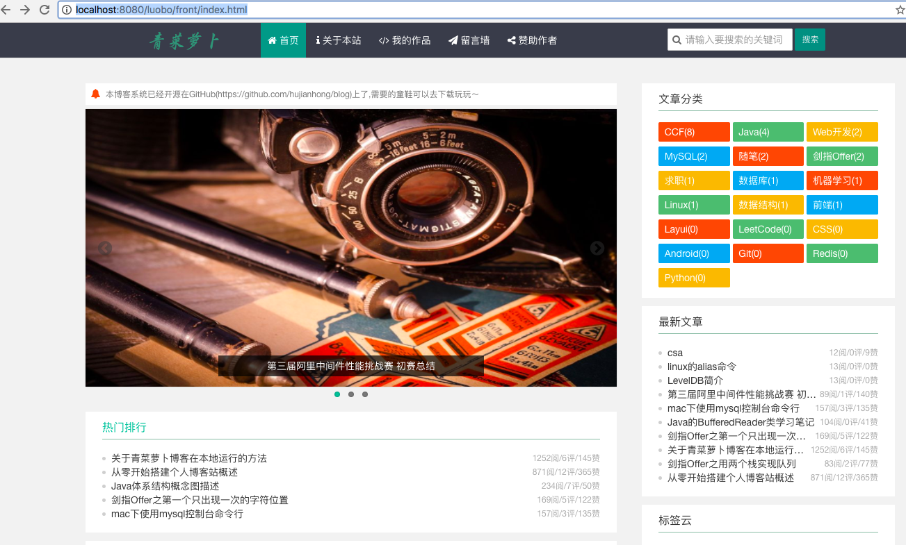
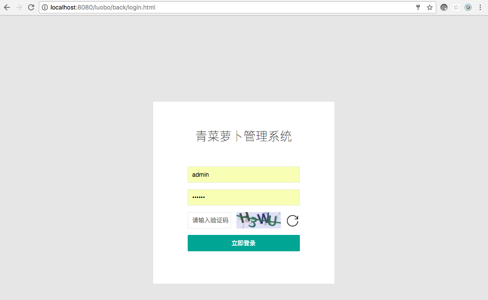
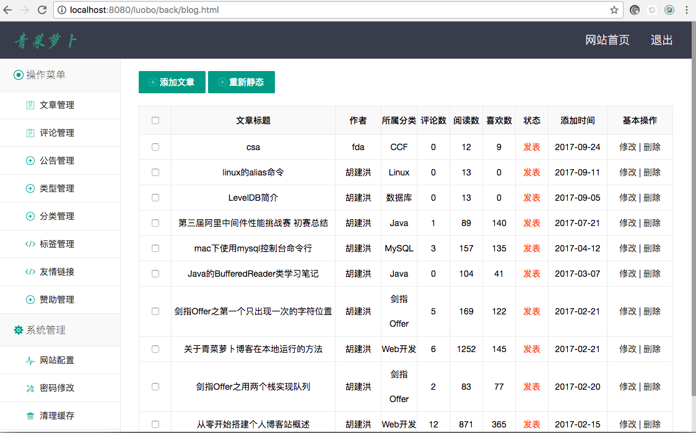

# 青菜萝卜博客系统V2.0

在2017年2月份开源了[青菜萝卜博客系统V1.0](https://github.com/hujianhong/blog)，开源后不久陆续有同学向我反馈问题，主要集中在项目部署、项目构建等方面，这次趁着空闲时间，将原先的博客系统进行升级，降低部署难度和学习成本。这次的修改在代码方面没有太多的改进，主要是在项目构建方式以及目录结构修改上，具体的说明如下。

## 更新说明

1. 将原先的普通Java Web项目[luobo](https://github.com/hujianhong/blog/tree/master/luobo)修改为Maven构建的Java Web项目,方便使用Maven的同学使用源码构建项目，然后部署。
2. 同时将静态资源<strong>qingcai-front(前台展示）</strong>、<strong>qingcai-back（后台管理）</strong>和<strong>luobo（Java项目）</strong>整合到一个项目中，这样降低了部署难度，只需将构建好的部署包直接放到[Tomcat](http://tomcat.apache.org/)或者[Jetty](http://www.eclipse.org/jetty/)容器中，然后启动服务器即可完成部署。


## 部署说明

部署有两种方式，一种是直接使用我打包好的部署包，另一种是使用源码构建出部署包。不管怎么样部署，都需要数据库MySQL支持，[V1.0版本](https://github.com/hujianhong/blog)需要手动执行数据库脚本，不太方面，[V2.0版本](https://github.com/hujianhong/Duang)只需要在MySQL命令行客户端执行以下命令即可完成数据库创建

> create database qingcailuobo;

上述命令仅仅创建一个空的数据库，至于数据库表，都将在应用部署成功启动后自动连接数据库，创建数据库表，并导入部分初始数据。


下面分别进行应用部署说明。


### 1.直接安装

安装包有两种格式的，一个是zip格式的,[点我下载](http://www.huding.name/qingcailuobo.zip) ,推荐这种方式。另一种是war格式的,[点我下载](http://www.huding.name/qingcailuobo.war)。这两种格式都可以实现部署，只不过zip解压挺方便的，使用常见的解压缩工具即可完成解压，war格式的，可以借助jar命令完成解压。

完成解压后，在目录<strong>luobo/WEB-INF/classes</strong>下找到config.properties文件，初始配置信息如下：

```
#数据库配置信息
[DATABASE]
#数据库地址
DB_URL = jdbc:mysql://localhost:3306/qingcailuobo?useUnicode=true&characterEncoding=UTF-8
#数据库连接用户名
DB_USERNAME = root
#数据库连接密码
DB_PASSWORD = root

#前台的根目录,	一般直接设置为front
FRONT_PATH = front

```

只需要修改其中的数据库连接信息即可，即DB_URL,DB_USERNAME,DB_PASSWORD即可。


然后将<strong>luobo</strong>文件夹直接拷贝至Tomcat或者Jetty的webapps目录下，然后启动Tomcat或者Jetty服务器，完成部署。


最后，在浏览器的地址栏输入: <strong>http://localhost:8080/luobo/front/index.html</strong>,如果能够看到如下界面,那么恭喜你成功完成部署。




后台管理系统的登录地址是：<strong>http://localhost:8080/luobo/back/login.html</strong>,访问界面如下，输入账号：admin 密码：123456，以及界面上的验证码即可完成登录。




登录成功后的，后台管理界面如下：




### 2.源码安装


源码安装也是比较简单的，从GitHub: [https://github.com/hujianhong/Duang](https://github.com/hujianhong/Duang) 将源码下载下来，然后在<strong>luobo/src/main/java/resources</strong>目录下找到config.properties文件，并修改数据库连接信息，然后在<strong>luobo</strong>这个根目录下，运行maven打包命令：

> mvn package

运行结束后，将<strong>target</strong>目录下的luobo.war直接拷贝到Tomcat或者Jetty的webapps目录下，然后启动Tomcat或者Jetty服务器，即可完成部署。

剩下的步骤和直接部署的过程是一样的，就不再赘述了。


## 任何疑问

如果有任何部署方面的疑问，或者代码上的Bug都可以直接在GitHub上发起issues,或者直接联系我，我的邮箱为：hunter@huding.me.

胡建洪 2017年9月25日
